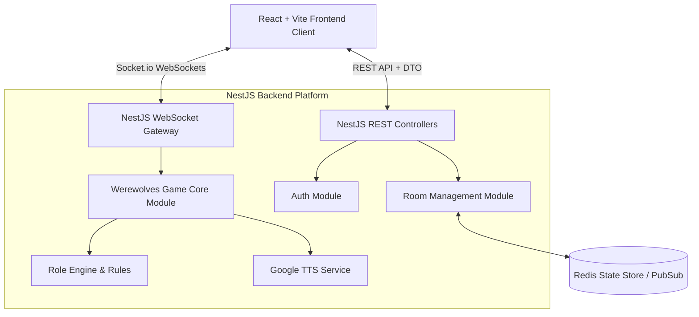

# 📋 Vấn đề Cần Sửa & Đánh giá Clean Code - GameHub Platform

> Document ghi nhận chi tiết toàn bộ các hạn chế, lỗi kiến trúc và điểm vi phạm Clean Code hiện tại trong toàn bộ hệ thống **GameHub Platform**.

---

## 1. 🔍 Tổng quan Hiện trạng Hệ thống (Current State Overview)

Hệ thống **GameHub Platform** hiện đang được tổ chức theo mô hình Monorepo Node.js Workspaces (`apps/*`, `games/*`, `packages/*`). Tuy nhiên, việc thực thi phần core lại đang dùng **Node.js thuần (Vanilla Node.js)** kết hợp với Vanilla JavaScript ở phía Frontend.

---

## 🛑 2. Danh sách các Vấn đề Kiến trúc & Clean Code (Core Problems)

### 🔴 ISSUE 1: Monolithic File & God Object (`games/werewolves/server.js`)
- **Mô tả**: File [server.js](file:///d:/Users/Documents/GitHub/gamehub-platform/gamehub/games/werewolves/server.js) dài gần **1,450 dòng code**, ôm xô toàn bộ trách nhiệm:
  - Routing HTTP REST API (`/api/join`, `/api/action`, `/api/settings`, `/api/start`,...).
  - Đọc/ghi static files và SSE connections pool (`sseClients`).
  - Logic game Ma Sói (chuyển phase Đêm/Ngày, xử lý bình chọn, tính toán tử vong).
  - Quản lý Timer đếm ngược (`dayTimer`, `setInterval`).
  - Gọi dịch vụ Google Translate TTS API.
- **Tác hại**: Vi phạm nghiêm trọng nguyên tắc **Single Responsibility Principle (SRP)**. File quá lớn gây khó đọc, cực kỳ rủi ro khi refactor hoặc thêm vai trò mới.

---

### 🔴 ISSUE 2: Routing HTTP & Parsing dữ liệu thủ công (Manual HTTP & Stream Parsing)
- **Mô tả**: Bộ router hiện tại trong cả [apps/server/server.js](file:///d:/Users/Documents/GitHub/gamehub-platform/gamehub/apps/server/server.js) và [games/werewolves/server.js](file:///d:/Users/Documents/GitHub/gamehub-platform/gamehub/games/werewolves/server.js) sử dụng `http.createServer` thuần:
  - Phải tự viết hàm đọc stream JSON `readJson(req)`.
  - Phải tự parse URL và chuỗi query `new URL(req.url, ...)`.
  - Phải tự switch-case chuỗi `req.method === 'POST' && requestUrl.pathname === '...'`.
  - Phải tự mapping MIME types `MIME_TYPES` để serve file tĩnh.
- **Tác hại**: Vi phạm nguyên tắc **DRY (Don't Repeat Yourself)**, dễ gặp lỗi bảo vệ bộ nhớ (memory exhaustion khi read body không limit size) và thiếu middleware xử lý CORS, Authentication, Error handling chuẩn.

---

### 🔴 ISSUE 3: Quản lý Trạng thái In-Memory & Không thể Mở rộng (Non-scalable In-Memory State)
- **Mô tả**:
  - Trạng thái các phòng chơi `rooms` được lưu trong `Map()` biến toàn cục.
  - Client SSE được lưu trong `Set()`.
  - Timer đếm ngược lưu trong biến local `dayTimer`.
- **Tác hại**: Không thể scale out hệ thống lên nhiều server instance (Multi-node / Cluster). Khi server restart, toàn bộ game state của người chơi bị mất sạch. Không có cơ chế Redis Pub/Sub hay Database persistence.

---

### 🔴 ISSUE 4: Thiếu An toàn Kiểu Dữ liệu (No Type Safety / No Schema Validation)
- **Mô tả**: Toàn bộ codebase viết bằng **JavaScript thuần (ES6)**.
  - Không có TypeScript hay DTO (Data Transfer Object).
  - Các object `game`, `player`, `role`, `action` không có schema định nghĩa rõ ràng.
- **Tác hại**: Rất dễ phát sinh lỗi runtime crash (như `Cannot read property 'alive' of undefined`) khi client gửi payload sai cấu trúc hoặc khi đổi tên thuộc tính.

---

### 🔴 ISSUE 5: Cơ chế Real-time SSE Thủ công & Thiếu Đột phá (Brittle Real-Time Communication)
- **Mô tả**: Hệ thống sử dụng kết hợp **HTTP POST** để gửi hành động và **Server-Sent Events (SSE)** để push state từ server về client.
- **Tác hại**:
  - SSE chỉ là giao tiếp 1 chiều (Server ➔ Client). Client gửi action vẫn phải dùng HTTP POST riêng biệt.
  - Quản lý SSE client bằng `Set()` thủ công dễ bị rò rỉ bộ nhớ (Memory Leak) khi client mất kết nối đột ngột mà không trigger `req.on('close')`.
  - Không tối ưu bằng **WebSockets (Socket.io)** có sẵn cơ chế heartbeat, auto-reconnect, binary transport, và room channels.

---

### 🔴 ISSUE 6: Giao diện Frontend Spikes & Ghép chuỗi HTML (Vanilla JS DOM Spikes)
- **Mô tả**: Các file Frontend tại [games/werewolves/public/app.js](file:///d:/Users/Documents/GitHub/gamehub-platform/gamehub/games/werewolves/public/app.js) (~35KB) và [public/player.js](file:///d:/Users/Documents/GitHub/gamehub-platform/gamehub/games/werewolves/public/player.js) (~10KB):
  - Sử dụng ghép chuỗi HTML (`element.innerHTML = ...`) để render UI.
  - Không có Component hierarchy, không có State management (Redux/Zustand/Context).
  - Tự bắt sự kiện DOM thủ công với hàng chục `document.getElementById()`.
- **Tác hại**: Rất khó bảo trì giao diện, tiềm ẩn rủi ro **XSS Injection** khi ghép string tên người chơi trực tiếp vào HTML mà không qua sanitization.

---

### 🔴 ISSUE 7: Thiếu hụt Bộ kiểm thử Tự động (No Automated Test Suite)
- **Mô tả**: Dự án hiện chỉ kiểm tra cú pháp thông qua lệnh `node --check` trong `package.json`.
- **Tác hại**: Không có Unit Test cho các vai trò (Ma Sói, Tiên Tri, Bảo Vệ...), không có Integration Test cho quy trình chuyển phase (Đêm ➔ Ngày ➔ Bình chọn). Mỗi lần sửa code bắt buộc phải test tay rất tốn thời gian.

---

## 📁 3. Các File Cần Sửa / Refactor Chính (Affected Files)

| Đường dẫn File | Dung lượng / Dòng | Mức độ ảnh hưởng | Hướng xử lý |
| :--- | :--- | :--- | :--- |
| [gamehub/games/werewolves/server.js](file:///d:/Users/Documents/GitHub/gamehub-platform/gamehub/games/werewolves/server.js) | ~1,450 dòng | 🔴 Cực cao | Tách thành các Modules/Services/Controllers chuẩn |
| [gamehub/apps/server/server.js](file:///d:/Users/Documents/GitHub/gamehub-platform/gamehub/apps/server/server.js) | ~340 dòng | 🟠 Cao | Thay thế bằng NestJS / Express Gateway Router |
| [gamehub/games/werewolves/public/app.js](file:///d:/Users/Documents/GitHub/gamehub-platform/gamehub/games/werewolves/public/app.js) | ~35 KB | 🔴 Cực cao | Chuyển đổi sang React / Vue Component |
| [gamehub/games/werewolves/public/player.js](file:///d:/Users/Documents/GitHub/gamehub-platform/gamehub/games/werewolves/public/player.js) | ~10 KB | 🟠 Cao | Tích hợp thành React State Hook |
| [gamehub/games/werewolves/roles/*](file:///d:/Users/Documents/GitHub/gamehub-platform/gamehub/games/werewolves/roles) | 6 files | 🟡 Trung bình | Chuyển sang TypeScript Classes / Interfaces |

---

## 💡 4. Đề xuất Kiến trúc Mới (Proposed Modern Architecture)

### Framework được đề xuất:
1. **Backend**: **NestJS + Socket.io + TypeScript**
2. **Frontend**: **Vite + React (TypeScript) + Tailwind CSS**
3. **State Sync**: **Socket.io Client + Zustand**
